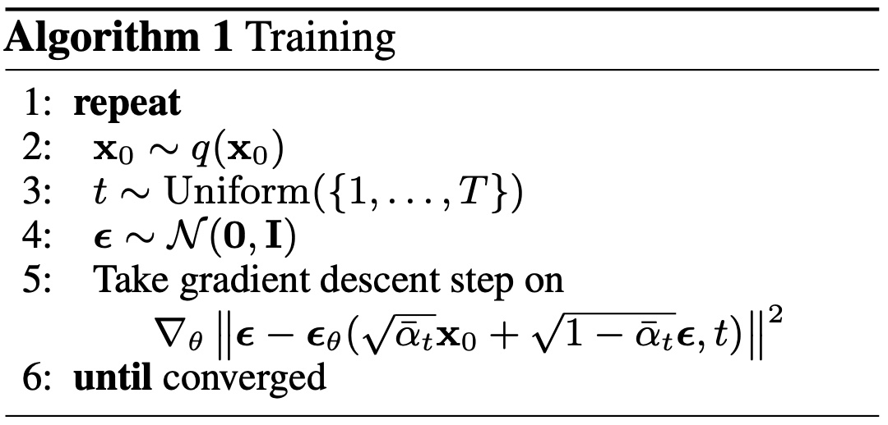

## 理解 Diffusion Model

### 物理理解

扩散模型的核心机制可通过热力学中的扩散与逆过程类比理解，以墨滴在水中扩散这一过程为例：

- **正向扩散（数据加噪）**：
如同将墨水滴入静水，墨水分子因布朗运动逐渐从有序分布（高浓度区）扩散至无序的均匀状态（热力学平衡）。此过程对应模型中向数据逐步叠加高斯噪声，每一步的噪声强度由扩散速率参数控制，模拟微观粒子受随机碰撞的累积效应。系统的熵（混乱度）随时间单调增加，直至数据完全退化为无结构的高斯噪声。

- **逆向生成（噪声去噪）**：
物理上自发逆向扩散需违反熵增定律，但但扩散模型通过数据驱动的统计学习实现了等效操作。其核心是构建一种“逆向动力学”——模型在训练阶段通过观测大量正向扩散轨迹，隐式拟合出能够表征数据分布结构的概率流场。这一概率流场在微观层面等效于一个虚拟的“驱动力场”，其方向始终指向原始数据分布的高密度区域（即墨滴的初始低熵态）。生成过程中，模型基于当前噪声状态解析出概率流场的局部梯度信息，逐步修正各自由度（如像素）的取值，使系统沿自由能下降方向演化，最终将无序噪声重新组织为符合训练数据统计规律的有序结构。

<!--  -->

### 数学理解

从生成模型的数学框架出发，其核心目标是在数据空间 $\mathcal{X}$（如[x, y]的2D分布数据、[3\*H\*W]的图像数据、[3\*H\*W\*T]的视频数据等）中用网络输出的分布 $q_\theta(x|z)$ 逼近真实数据的分布 $p^{*}(x)$：
$$
p_\theta(x|z) \leftarrow p^{*}(x) \tag{1}
$$

在这个大的目标下，不同的生成范式采用了不同的数学方法，比如：

- **VAE** 通过编码-解码压缩表征，引入潜变量 $z \sim q_\phi(z|x)$，优化证据下界（ELBO）来逼近 $p^*$。
- **GAN** 通过*对抗博弈*隐式逼近 $p^{*}$，其生成器 $G_\theta(z)$ 与判别器 $D_\phi(x)$ 在极小极大目标中竞争，迫使生成分布 $p_\theta(x)$ 覆盖 $p^{*}$ 的支撑集。
- **AR** 通过自回归分解 $p(x) = \prod_{i=1}^D p(x_i|x_{<i})$ 建模数据分布 $p^{*}$。

而 Diffusion Model 则将数据生成建模为一个马尔可夫扩散过程，将原始数据分布 $p^{*}(x)$ 逐步扰动至高斯噪声 $\mathcal{N}(0, I)$，从而构造一个可逆的概率轨迹：
$$
p^{*} = p_0 \rightarrow p_1 \rightarrow \cdots \rightarrow p_{T-1} \rightarrow p_T = \mathcal{N}(0, I)
$$
不同于直接拟合最终数据分布，Diffusion Model 拟合的是该逆轨迹的转移概率：
$$
q_\theta(x_{t-1}|x_t) \leftarrow q(x_{t-1}|x_t) = p_{t \rightarrow t-1}
$$

## Diffusion 的前向过程

接下来，我们将逐步在数学/代码上推导/实现 Diffusion 的前向过程。

给定一个真实的数据分布，定义为 $q(x)$，本文以一个 2D 瑞士卷分布为例实现：


```python
import torch
import numpy as np
import matplotlib.pyplot as plt

# 生成2D瑞士卷数据
n_samples = 5000
t = 3 * np.pi / 2 * (1 + 2 * np.random.rand(n_samples))  # 角度参数
x = t * np.cos(t)  # x坐标
y = t * np.sin(t)  # y坐标
data = np.stack([x, y], axis=1)

# 添加垂直噪声并标准化
data += 0.1 * np.random.randn(n_samples, 2)
data = (data - np.mean(data, axis=0)) / np.std(data, axis=0)
data = torch.FloatTensor(data)

# 可视化该分布
plt.figure(figsize=(2, 2))
plt.scatter(data[:,0], data[:,1], s=1, alpha=0.7, 
                c=np.linspace(0,1,len(data)), cmap='viridis')
plt.tight_layout()
plt.axis('equal')
plt.show()
plt.close()

print(data[0])
```


    
<!--  -->
    


    tensor([-1.1089,  0.9292])


> 注意：在 Diffusion Model 中，所有的工作都是在“分布”上面进行的，而非“样本”（这是与传统的判别式网络不同的地方），因此本文为了强调这一点，将上述分布作为例子。
> 以该分布为例，每个样本为一个 2D 的数据，如 [-1.0829,  0.9256]，该样本点在瑞士卷上，而整个瑞士卷则代表了整个数据的分布。

### 前向过程的递推形式

在基于高斯的前向过程中，我们将在任意时刻$t$的加噪转移概率构造为：
$$
q(\mathbf{x}_t | \mathbf{x}_{t-1}) = \mathcal{N}(\mathbf{x}_t; \sqrt{1-\beta_t}\mathbf{x}_{t-1}, \beta_t\mathbf{I})
$$

> 初学者一般会在这儿卡住，为什么这里要这么设计，突然出现的$\beta_t$又是什么？
从信息的角度来讲，这是在将原信号$x_{t-1}$ 与噪声信号$N(0,I)$通过缩放系数$\sqrt{1-\beta_t}$和$\sqrt{\beta_t}$进行“调制”后叠加，这里每经过一步原信号就会衰减一些，而噪声信号就会增大一些，经过足够大的步数之后，信号就只剩噪声信号了。
而从数学的角度来讲，这种构造能够保证终态$x_T$收敛到预先设计的$N(0,I)$上，同时也有闭式解直接计算任意时刻$t$的状态。

这里我们称 $\beta_t$ 为噪声方差系数，$\{\beta_0, \cdots, \beta_T\}$则被称为噪声调度器(Noise Scheduler)。

在实际中，如果我们要从上述转移概率分布中随机采样一个样本，这个过程是无法反传梯度的。因此这里我们使用了一个重参数化(reparameterization trick)的技巧，我们可以通过采样一个标准高斯噪声 $\mathbf{\epsilon} \sim \mathcal{N}(\mathbf{0}, \mathbf{I})$ 将随机性引到该独立的随机变量中，从而确定:
$$
\mathbf{x}_t = \sqrt{1 -\beta_t} \mathbf{x}_{t-1} + \sqrt{\beta_t} \mathbf{\epsilon}
$$


```python
def one_step_forward(x_prev, beta_t):
    epsilon = torch.randn_like(x_prev)      # N(0,1)
    x = torch.sqrt(1 - beta_t) * x_prev + torch.sqrt(beta_t) * epsilon
    return x
```

这里我们使用 DDPM 的 $\beta_t$ 构造，其为从 1e-4 到 0.02 步数为 1000 的线性调度：


```python
def linear_beta_schedule(timesteps):
    beta_start = 1e-4
    beta_end = 0.02
    return torch.linspace(beta_start, beta_end, timesteps)

# define beta schedule
timesteps = 1000
betas = linear_beta_schedule(timesteps=timesteps)
```

我们也可以进一步观测一下 $\sqrt{1 -\beta_t}$ 和 $\sqrt{\beta_t}$：


```python
sqrt_one_minus_beta = torch.sqrt(1.-betas)
sqrt_beta = torch.sqrt(betas)

fig, axes = plt.subplots(1, 2, figsize=(10, 2))
axes[0].plot(sqrt_one_minus_beta)
axes[1].plot(sqrt_beta)
plt.show()
plt.close()
```


    
<!--  -->
    


这样我们就可以实现整个前向过程了：


```python
from tqdm import tqdm

data_t = [data]
# 逐步加噪
for t in tqdm(range(1, timesteps)):
    data_t.append(one_step_forward(data_t[t-1], betas[t]))
    
# 可视化不同时间步的加噪效果
selected_t = [0, 29, 59, 99, 299, 999]
plt.figure(figsize=(15, 3))

for idx, t in enumerate(selected_t, 1):
    current_data = data_t[t]
    
    plt.subplot(1, len(selected_t), idx)
    plt.scatter(current_data[:,0], current_data[:,1], s=1, alpha=0.7, 
                c=np.linspace(0,1,len(current_data)), cmap='viridis')
    plt.title(f"t = {t}")
    plt.axis('equal')
    plt.axis('off')
    plt.grid(False)

plt.tight_layout()
plt.show()
plt.close()
```

    100%|██████████| 999/999 [00:00<00:00, 23935.28it/s]


    
<!--  -->
    


### 前向过程的解析解

除了通过递推形式进行前向过程，我们也可以根据高斯分布的特性 (sums of Gaussians is also Gaussian) 直接求出从$x_0$到任意时刻$x_t$的转移概率：
$$
q(\mathbf{x}_t | x_0) = \mathcal{N}(\mathbf{x}_t; \sqrt{\bar{\alpha}_t}\mathbf{x}_0, (1-\bar{\alpha}_t)\mathbf{I})
$$
其中 $\alpha_t = 1 - \beta_t$， $\bar{\alpha}_t = \prod_{s=1}^t \alpha_s$。

简略推导过程：
1. 根据 $\mathbf{x}_t = \sqrt{1 -\beta_t} \mathbf{x}_{t-1} + \sqrt{\beta_t} \mathbf{\epsilon}$ 递归展开易得 $\mathbf{x}_t = \prod_{s=1}^t \sqrt{1-\beta_s} \cdot \mathbf{x}_0 + \sum_{s=1}^t \sqrt{\beta_s} \prod_{k=s+1}^t \sqrt{1-\beta_k} \cdot \epsilon_s$。
2. 由高斯叠加特性，令噪声项 $\epsilon \sim N(0, I)$，并记：
   $ \alpha_t = 1 - \beta_t; ~ \bar{\alpha}_t = \prod_{s=1}^t \alpha_s$
   有 $\mathbf{x}_t = \sqrt{\bar{\alpha}_t} \mathbf{x}_{0} + \sqrt{1-\bar{\alpha}_t} \mathbf{\epsilon}$。

代码实现为：


```python
# 预先计算中间变量
alphas = 1. - betas
alphas_cumprod = torch.cumprod(alphas, axis=0)

sqrt_alphas_cumprod = torch.sqrt(alphas_cumprod)
sqrt_one_minus_alphas_cumprod = torch.sqrt(1. - alphas_cumprod)

def sample_forward(x_0, t):
    epsilon = torch.randn_like(x_0)

    sqrt_alphas_cumprod_t = sqrt_alphas_cumprod[t]
    sqrt_one_minus_alphas_cumprod_t = sqrt_one_minus_alphas_cumprod[t]

    return sqrt_alphas_cumprod_t * x_0 + sqrt_one_minus_alphas_cumprod_t * epsilon

# 观测一下曲线
fig, axes = plt.subplots(1, 2, figsize=(10, 2))
axes[0].plot(sqrt_alphas_cumprod)
axes[1].plot(sqrt_one_minus_alphas_cumprod)
plt.show()
plt.close()
```


    
<!--  -->
    


可以观测到随着 $t$ 的增加，均值会逼近 0，方差会逼近 1。

进行闭式解的验证，整体加噪强度是与单步递推是一致的。


```python
data_t = [data]
selected_t = [0, 29, 59, 99, 299, 999]

# 直接加噪
for t in selected_t:
    data_t.append(sample_forward(data, t))
    
# 显示加噪的过程
plt.figure(figsize=(15, 3))
for idx, t in enumerate(selected_t, 1):
    current_data = data_t[idx]
    
    plt.subplot(1, len(selected_t), idx)
    plt.scatter(current_data[:,0], current_data[:,1], s=1, alpha=0.7, 
                c=np.linspace(0,1,len(current_data)), cmap='viridis')
    plt.title(f"t = {t}")
    plt.axis('equal')
    plt.axis('off')
    plt.grid(False)
    
plt.tight_layout()
plt.show()
plt.close()
```


    
<!--  -->
    


我们将上述代码整理为一个类：


```python
class NoiseScheduler:
    def __init__(self, num_timesteps, device="cpu"):
        self.device = device
        self.num_timesteps = num_timesteps
        self.betas = self.linear_beta_schedule(num_timesteps).to(device)
        self.alphas = (1. - self.betas).to(device)
        self.alphas_cumprod = torch.cumprod(self.alphas, dim=0).to(device)
        self.sqrt_alphas_cumprod = torch.sqrt(self.alphas_cumprod).to(device)
        self.sqrt_one_minus_alphas_cumprod = torch.sqrt(1. - self.alphas_cumprod).to(device)
        
    def linear_beta_schedule(self, num_timesteps, beta_start=1e-4,beta_end=0.02):        
        return torch.linspace(beta_start, beta_end, num_timesteps)

    def add_noise(self, x_start, t):
        """
        添加噪声到输入图像或潜在表示。
        :param x_start: 初始清晰图像或潜在表示
        :param t: 当前时间步
        :return: 添加噪声后的表示
        """
        t = t.clone().detach().long().to(self.sqrt_alphas_cumprod.device)
        # 生成标准正态分布的噪声
        noise = torch.randn_like(x_start)
        # 获取所需的预计算值
        sqrt_alphas_cumprod_t = self.sqrt_alphas_cumprod[t].view(-1, 1)
        sqrt_one_minus_alphas_cumprod_t = self.sqrt_one_minus_alphas_cumprod[t].view(-1, 1)
        # 计算第t步、带噪声的图像
        x_t = sqrt_alphas_cumprod_t * x_start + sqrt_one_minus_alphas_cumprod_t * noise

        return x_t, noise
```

## Diffusion 的反向过程

### 反向过程的推导

如我们在数学理解一节中所述，我们的目标是通过网络拟合反向过程的分布 $q_\theta(x_{t-1}|x_t) \leftarrow q(x_{t-1}|x_t)$。然而，我们无法直接 estimate $p(x_{t-1}|x_t)$ ，其需要统计整个数据集的分布得到。

但在 $\beta_t$ 足够小时，$p(x_{t-1}|x_t)$ 也是一个高斯分布（简略证明思路：通过贝叶斯公式和泰勒展开，在 $T$ 足够大时，反向过程 $p(x_{t-1}|x_t)$ 将由展开项中的 $p(x_t|x_{t-1})$ 主导，因此其也符合高斯分布），即：
$$
p_\theta(x_{t-1}|x_t)=\mathcal{N}(x_{t-1};\mu_\theta(x_t,t),\Sigma_\theta(x_t,t))
$$

因此，我们通过训练一个模型来预测该分布的均值和方差。在 DDPM 中，该方差被固定为$\Sigma_\theta(\mathbf{x}_t,t)=\sigma_t^2\mathbf{I},\sigma_t^2:=\beta_t$，因此模型只需预测均值$\mu_\theta$。

另一方面，在给定 $x_0$ 时，我们可以去处理 $q(x_{t-1}|x_t,x_0)$：

$$
q(x_{t-1}|x_t,x_0) = q(x_t|x_{t-1},x_0) \frac{q(x_{t-1}|x_0)}{q(x_t|x_0)}
$$

上式右边各项都是已知的前向过程，并且各项都是高斯分布，通过写出其概率密度函数，并整理（过程略），有：
$$
\tilde{\mu}_t(x_t, x_0) = \frac{\sqrt{\alpha_t}(1-\bar{\alpha}_{t-1})}{1-\bar{\alpha}_{t}} x_t + \frac{\sqrt{\bar{\alpha}_{t-1}}\beta_t}{1-\bar{\alpha}_{t}} x_0
$$

进一步代入前向过程的解析解，$\mathbf{x}_t = \sqrt{\bar{\alpha}_t} \mathbf{x}_{0} + \sqrt{1-\bar{\alpha}_t} \mathbf{\epsilon_t}$，消掉 $x_0$，有：
$$
\tilde{\mu}_t=\frac{1}{\sqrt{\alpha_t}}(\mathbf{x}_t-\frac{\beta_t}{\sqrt{1-\bar{\alpha}_t}}\epsilon_t)
$$

同理，也可以推导出方差：
$$
\sigma_t^2 = \frac{1-\bar{\alpha}_{t-1}}{1-\bar{\alpha}_t}\beta_t
$$

上述等式右边只有 $\epsilon_t$ 未知，因此预测均值 $\mu_\theta$ 也可以等价为预测噪声 $\epsilon_\theta$，同时，也可以等价于预测原图 $(x_0)_\theta$。

进一步地，在进行上述模型训练时，对于真实的训练样本数据已知，要求模型的参数，可以使用极大似然估计，并使用变分下界(VLB)来优化负对数似然，这一部分推导出来（过程略）是一个极其符合直觉的结论，即其等价于优化在所有时间步上对噪声预测误差的期望！
因此，我们的优化目标极为简洁：
$$
L=\Vert\epsilon-\epsilon_\theta(x_t, t)\rVert^2
$$

至此，我们完成了 Diffusion 的反向过程的推导，接下来我们将通过瑞士卷分布具体地实现它。

### 模型定义

由于瑞士卷分布比较简单，我们通过一个简单的 MLP即可实现。但是这里要注意的是，网络要将 timestep 这一信息作为输入。


```python
import math
import torch.nn as nn
import torch.optim as optim

# ====================
# 神经网络模型定义
# ====================
class TimeEmbedding(nn.Module):
    """时间步的位置编码"""
    def __init__(self, dim):
        super().__init__()
        self.dim = dim
        inv_freq = torch.exp(torch.arange(0, dim, 2, dtype=torch.float32) * (-math.log(10000) / dim))
        self.register_buffer("inv_freq", inv_freq)

    def forward(self, t):
        # t: [batch_size]
        device = t.device
        pos_enc = t[:, None] * self.inv_freq[None, :]  # [batch_size, dim/2]
        return torch.cat([torch.sin(pos_enc), torch.cos(pos_enc)], dim=-1)  # [batch_size, dim]


class DiffusionModel(nn.Module):
    """噪声预测模型"""
    def __init__(self, input_dim=2, hidden_dim=256, time_dim=64):
        super().__init__()
        self.time_embed = TimeEmbedding(time_dim)
        
        # 输入嵌入模块
        self.input_embed = nn.Sequential(
            nn.Linear(input_dim, hidden_dim),
            nn.LayerNorm(hidden_dim),
            nn.SiLU(),
            nn.Linear(hidden_dim, hidden_dim),
            nn.LayerNorm(hidden_dim),
            nn.SiLU(),
        )
        
        # 时间步处理模块
        self.time_net = nn.Sequential(
            nn.Linear(time_dim, hidden_dim),
            nn.LayerNorm(hidden_dim),
            nn.SiLU(),
        )
        
        # 核心处理模块
        self.core_net = nn.Sequential(
            nn.Linear(hidden_dim*2, hidden_dim*2),
            nn.LayerNorm(hidden_dim*2),
            nn.SiLU(),
            nn.Linear(hidden_dim*2, hidden_dim),
            nn.LayerNorm(hidden_dim),
            nn.SiLU(),
            nn.Linear(hidden_dim, input_dim)
        )

    def forward(self, x, t):
        # 输入处理
        x_emb = self.input_embed(x)  # [B, H]
        t_emb = self.time_net(self.time_embed(t))  # [B, H]
        
        # 特征融合
        combined = torch.cat([x_emb, t_emb], dim=-1)
        return self.core_net(combined)
```

### 模型训练

根据上述的推导过程，我们可以得到如下的训练算法：




```python
from torch.utils.data import DataLoader, TensorDataset

# ====================
# 训练配置
# ====================
num_timesteps = 1000
batch_size = 128
device = torch.device("cuda" if torch.cuda.is_available() else "cpu")

model = DiffusionModel().to(device)
noise_scheduler = NoiseScheduler(num_timesteps, device=device)
optimizer = optim.AdamW(model.parameters(), lr=1e-5)

# 准备数据 (使用之前生成的Swiss Roll数据)
data_tensor = data.to(device)
dataset = TensorDataset(data_tensor)
dataloader = DataLoader(dataset, batch_size=batch_size, shuffle=True)
```


```python title='ipynb'
# ====================
# 训练循环
# ====================
loss_history = []
epochs = 1000
model.train()
for epoch in tqdm(range(epochs), desc="Training"):
    for batch in dataloader:
        x_0 = batch[0]
        
        # 随机采样时间步
        t = torch.randint(0, timesteps, (x_0.size(0),)).to(device)
        # 前向加噪过程
        x_t, noise = noise_scheduler.add_noise(x_0, t)
        # 预测噪声
        pred_noise = model(x_t, t)
        # 计算损失
        loss = nn.functional.mse_loss(pred_noise, noise)
        
        # 反向传播
        optimizer.zero_grad()
        loss.backward()
        optimizer.step()
        
        loss_history.append(loss.item())
```

```bash
Training: 100%|██████████| 1000/1000 [00:37<00:00, 26.99it/s]
```

```python
plt.figure(figsize=(12, 3))
plt.plot(loss_history)
plt.show()
```


    
<!--  -->
    


### 采样过程

在采样时，我们通过模型预测噪声 $\epsilon$ 进而得到均值 $\mu_t$，而方差是预先算好的，即 $\sigma_t = \beta_t I$ 据此再利用重参数化技巧进行采样，即可得到其采样的算法：

<!--  -->

这里要稍微注意在 $t=1$ 时，$\bar{\alpha}_t$ 是没有定义的，因此设 $z=0$。


```python
"""普通采样器（去噪）"""
@torch.no_grad()
def sample(model, noise_scheduler, num_samples):
    """
    从噪声开始，逐渐减小噪声，直到最终的图像。

    参数:
    - model: 模型用于预测噪声。
    - x_t: 当前时间步的噪声化表示 torch.Tensor
    - noise_scheduler: 噪声调度器 包含betas和其他预计算值
    - t: 当前时间步 torch.Tensor

    返回:
    - x_t: 去噪后的表示。
    """
    x_t = torch.randn(num_samples, 2).to(device)

    for t in reversed(range(num_timesteps)):
        t_tensor = torch.full((num_samples,), t, dtype=torch.long).to(device)

        # 获取当前时间步的beta和alpha值
        beta_t = noise_scheduler.betas[t]
        alpha_t = noise_scheduler.alphas[t]
        alpha_t_bar = noise_scheduler.alphas_cumprod[t]

        # 预测当前时间步的噪声
        predicted_noise = model(x_t, t_tensor)

        # 计算去噪后的表示
        if t > 0:
            noise = torch.randn_like(x_t).to(x_t.device)
        else:
            noise = torch.zeros_like(x_t).to(x_t.device)

        # 去噪公式
        x_t = (1 / torch.sqrt(alpha_t)) * (x_t - ((1 - alpha_t) / (torch.sqrt(1 - alpha_t_bar))) * predicted_noise) + torch.sqrt(beta_t) * noise

    return x_t.cpu().numpy()
```


```python
model.eval()
sample_data = sample(model, noise_scheduler, 5000)
```


```python
# 可视化该分布
plt.figure()
plt.scatter(data[:,0], data[:,1], s=1, alpha=0.7, 
                c=np.linspace(0,1,len(data)), cmap='viridis')
plt.scatter(sample_data[:,0], sample_data[:,1], s=2, 
                c=np.linspace(0,1,len(sample_data)), cmap='Blues')
plt.axis('equal')
plt.tight_layout()
plt.show()
plt.close()
```


    
<!--  -->
    


如上，在本文中，我们使用了一个简单的 2D 瑞士卷分布作为例子，通过 DDPM 完成了其分布的学习。

在下一篇文章中，我们将基于本文进行以下改进：
- 更实用的数据分布：Fashion-MNIST 数据集
- 模型结构升级为 Unet
- 从 unconditional 到 class-conditioned 的模型
- 采样器升级为 DDIM

## 参考

- [Step-by-Step Diffusion: An Elementary Tutorial](https://arxiv.org/pdf/2406.08929)
- [The Annotated Diffusion Model - Huggingface](https://huggingface.co/blog/annotated-diffusion)
- [Diffusion-book-cn - Huggingface Community](https://huggingface.co/datasets/HuggingFace-CN-community/Diffusion-book-cn/tree/main)
- [What are Diffusion Models? - Lilian Weng](https://lilianweng.github.io/posts/2021-07-11-diffusion-models/)
- [扩散模型(Diffusion Model)详解 - 周弈帆](https://zhouyifan.net/2023/07/07/20230330-diffusion-model/)
- [Diffusion Models：生成扩散模型 - 郑英林](https://yinglinzheng.netlify.app/diffusion-model-tutorial/)
